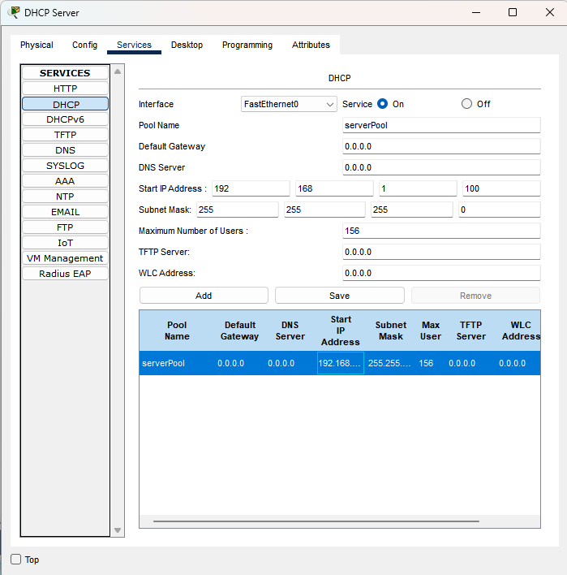
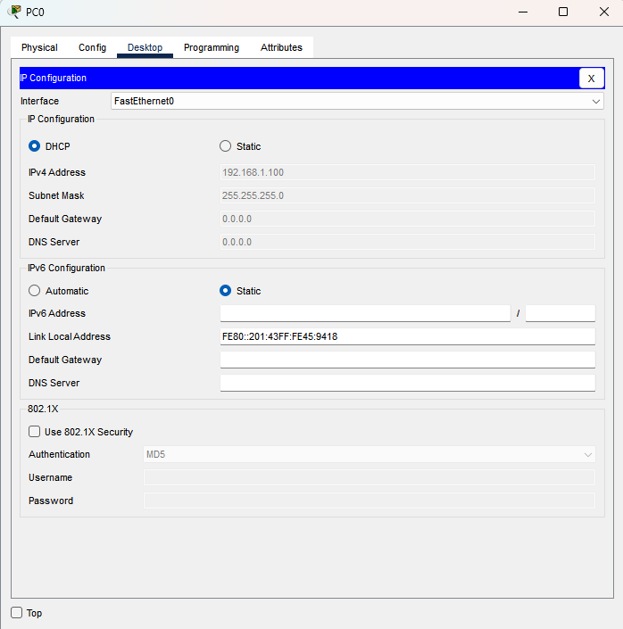
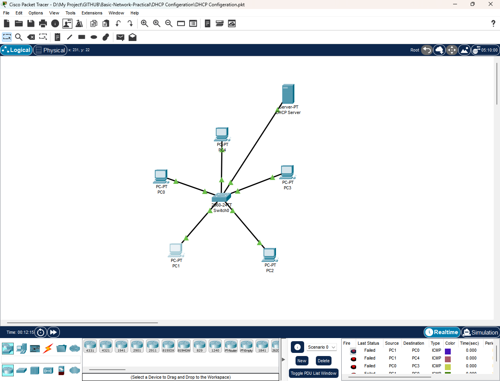
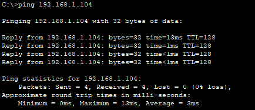

# Simple LAN Network with DHCP Server

## 🎯 Objective
Provide Automatic IP Addresses to LAN PCs using a DHCP Server.

## 🖥️ Components
- 1 Server (DHCP Enabled)
- 1 Switch
- 5 PCs

## 🛠️ Build Guide
1. Connect PCs & DHCP to the Switch using Straight Through Cable.
2. Assign Static IP on DHCP Server.
3. Verify Clients Receive Correct IP.
  
### Step 1 – DHCP Configurations
- Packet Tracer: Click on the Server → Services → DHCP

### Step 2 – PC Configurations
- Packet Tracer: Click on the PC → Desktop → Select DHCP

## ✅ Expected Result
- Every PCs Should Automatically Get IPs from 192.168.1.100 - 200 Range & Subnet Mask.
- Every PCs Should Successfully ping Each Other and DHCP Server.

---

