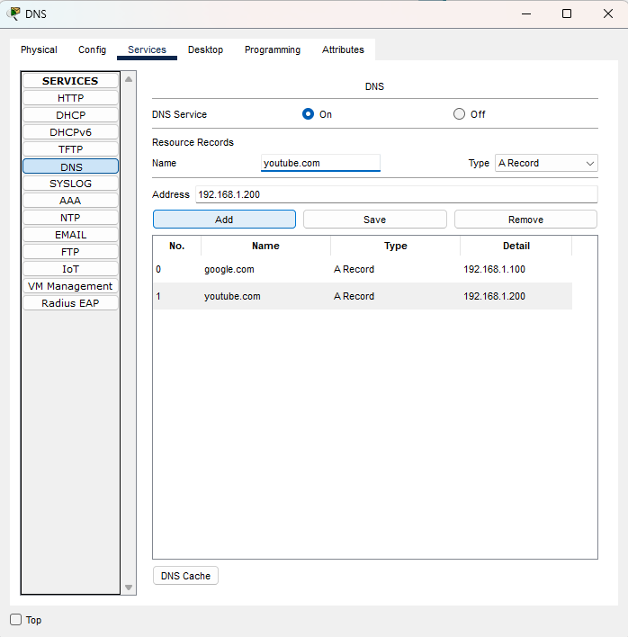
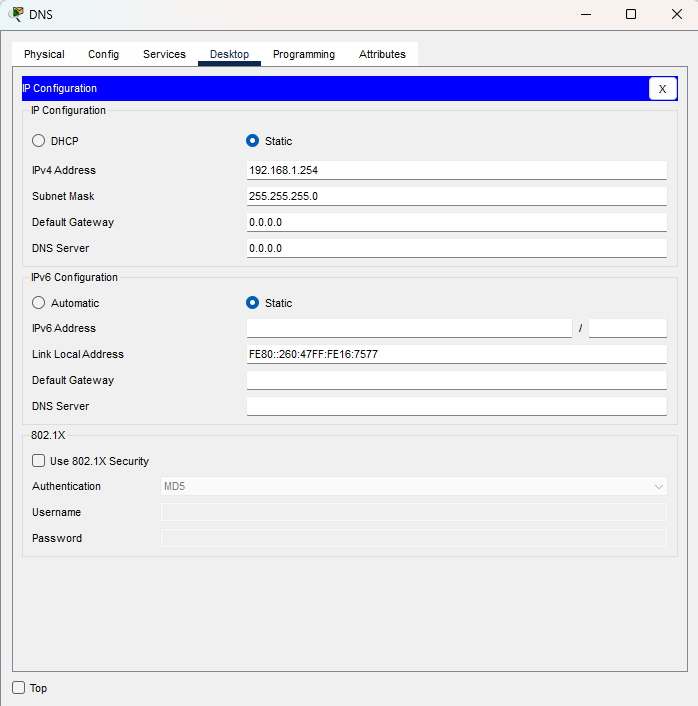
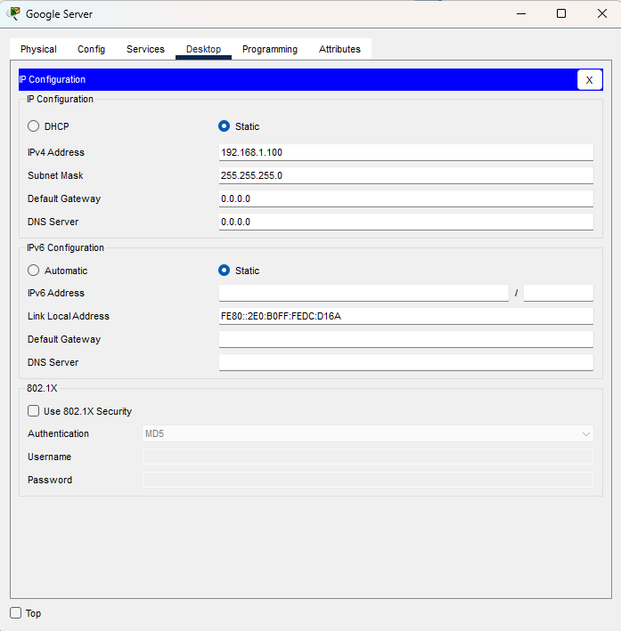
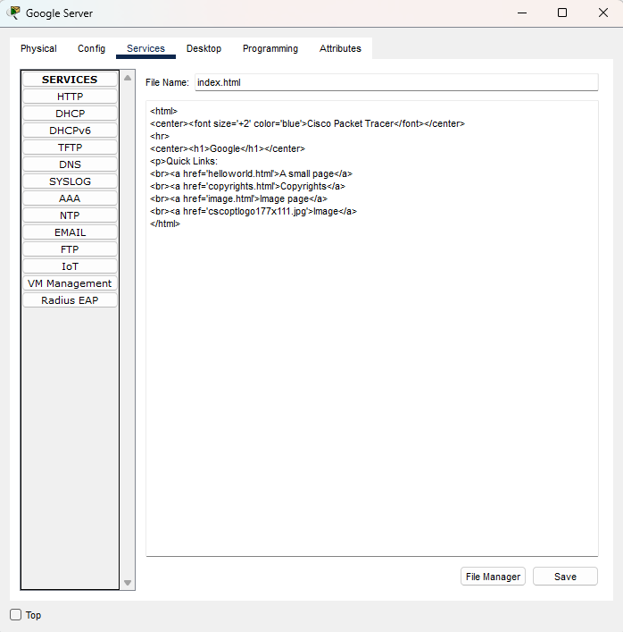
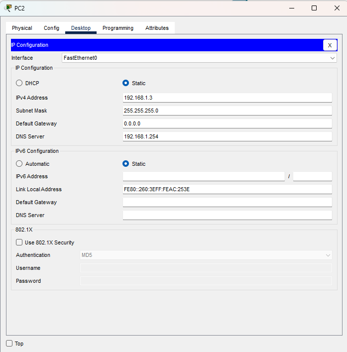
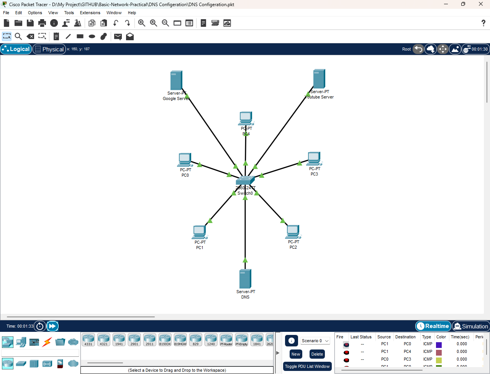
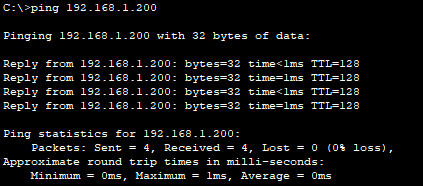

# Simple LAN Network with DNS

## 🎯 Objective
Configure a Simple DNS.

## 🖥️ Components
- 2 Server (HTTP/HTTPS Enabled)
- 1 Server (DNS Enabled)
- 1 Switch
- 5 PCs

## 🛠️ Build Guide
1. Connect PCs & Servers to the Switch using Straight Through Cable.
2. Assign Static IP on DNS & Other Servers.
3. Verify They are in the Same Subnet.
4. Test with `ping`.
  
### Step 1 – DNS Configuration
- Packet Tracer: Click on the Server → Services → DNS → Add a Record
- `www.google.com` → 192.168.1.100
- `www.youtube.com` → 192.168.1.200
</td>

- Packet Tracer: Click on the Server → Desktop → IP Configuration

### Step 2 – Normal Server Configuration
- Packet Tracer: Click on the Server → Desktop → IP Configuration

- (Optional)Packet Tracer: Click on the Server → Services → HTTP → Click Edit on 'index.html' → Edit html Code

### Step 3 – PC Configuration
- Packet Tracer: Click on the PC → Desktop → IP Configuration
PC0:
- IP: 192.168.1.1/24
- DNS: 192.168.1.254

PC1:
- IP: 192.168.1.2/24
- DNS: 192.168.1.254

PC2:
- IP: 192.168.1.3/24
- DNS: 192.168.1.254

PC3:
- IP: 192.168.1.4/24
- DNS: 192.168.1.254

PC4:
- IP: 192.168.1.5/24
- DNS: 192.168.1.254

## ✅ Expected Result
- Client Successfully Resolves `www.google.com` and `www.youtube.com`  
- Verified with `nslookup`

---

